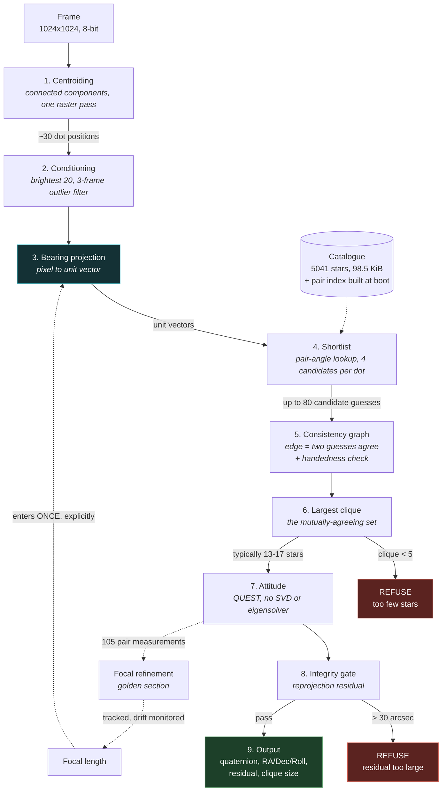
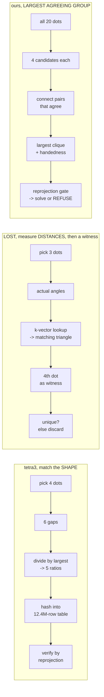

# Star Tracker Suite

An allocation-free star tracker for small satellites, benchmarked head-to-head against
the two best-known open-source solvers on identical inputs.

The distinguishing property is not speed or accuracy. It is **knowing when to refuse**.

---

## 1. What a star tracker does, in plain language

A satellite needs to know which way it is pointing. The most accurate way to find out is
to photograph the stars, because the stars are fixed and their positions are known to
extreme precision.

So the job is:

```
photo of some bright dots  ->  which dot is which star?  ->  therefore, which way am I facing?
```

The hard part is the middle step. A photo of a 20-degree patch of sky shows perhaps 30
dots. The catalogue contains thousands of stars. Nothing about a single dot identifies it, every star looks like a white blob. The only usable information is **the angles between
dots**, because rotating the camera does not change the angle between two stars.

Every star tracker exploits this. They differ in how.

### The one term you need: focal length

Focal length is how zoomed-in the camera is. It converts *"these two dots are 200 pixels
apart"* into *"these two stars are 4 degrees apart in the sky"*. Get it wrong and every
angle you compute is wrong by the same percentage, a ruler with mis-printed markings.
This single number drives most of the differences below.

---

## 2. The three solvers

### tetra3 (ESA), match the *shape*

Takes 4 dots, measures the 6 gaps between them, and **divides them all by the largest**:

```
gaps:    2.1°  3.4°  4.0°  5.2°  6.8°  8.5°
÷ 8.5 ->  0.25  0.40  0.47  0.61  0.80      <- looked up in a dictionary of every 4-star shape
```

It stores no absolute angle, only proportions. If your focal length is wrong by 5%, every
gap shrinks by 5% and **the proportions are unchanged**: the error cancels. It can even
work the focal length out afterwards.

> Like recognising a face in a photo. You do not need to know whether the print is
> postcard or poster sized; the proportions are the same.

The price is the dictionary: **47.1 MiB on disk, 94.6 MiB resident**, 6.18 million
patterns. That does not fit on a
satellite.

### LOST (UWCubeSat), measure the *distances*, then get a witness

Takes three dots, measures the **actual** angles, and finds a matching triangle in a sorted
list of every catalogue pair. Then brings in a fourth dot as a witness: if its three
distances to the first three also check out, the answer is accepted. If two different star
groups both fit, it discards the whole thing rather than guessing.

> Like identifying a city from GPS coordinates. Extremely precise, if your GPS is
> accurate. If it is off by even a little you confidently land in the wrong city, because
> wrong coordinates are still perfectly self-consistent coordinates.

Database: **2.63 MiB** as generated here (size depends heavily on generation parameters --
see section 3.12). But the ruler must be right.

### Ours, find the *largest group whose stories agree*

Instead of a fixed group of four, we look for the **largest set of identifications that are
all consistent with one another**. The rest of this section works through exactly how,
because the mechanism is the part worth understanding.

> **"HIP"** is a Hipparcos catalogue number, a stable serial number for a star, from the
> ESA Hipparcos mission (1989-93) which measured ~118,000 stellar positions precisely.
> HIP 91262 is Vega. We use the 5,041 stars brighter than magnitude 6.

#### Step 1: measure every angle between dots

Say the photo has five dots, A to E. Convert each to a direction in space using the focal
length, then measure all ten pairwise angles:

```
A-B  7.93°     B-C  5.42°     C-D   4.15°
A-C  7.10°     B-D  6.88°     C-E   9.02°
A-D  9.44°     B-E 11.20°     D-E  12.63°
A-E  6.31°
```

#### Step 2: hold an election

Ask the catalogue: which pairs of stars are 7.93° apart? Typically **hundreds** match. Do
this for all ten pairs, and let every matching catalogue pair cast a vote for its two stars.

The point is what the vote tally looks like:

```
Dot A's true identity, HIP 3822:
  right distance from B's true star   -> vote
  right distance from C's true star   -> vote
  ... and from every other real star  -> ~18 votes

A wrong candidate, HIP 7745:
  coincidentally right distance from B -> vote
  one further coincidence              -> vote
                                       -> 2 votes
```

**The true star collects votes from every other real star in the frame; a wrong star
collects only coincidences.** With 20 dots there are 190 pairs, so each dot is voted on
~190 times before we look at the result. Keep the top few per dot.

#### Step 3: connect the guesses that agree

Each surviving guess is a claim: *"A is HIP 1041."* Test two claims against each other:

> **A is HIP 1041** and **B is HIP 3822**
> Photo says A-B is **7.93°**. Catalogue says HIP 1041-HIP 3822 is **7.94°**. yes compatible
>
> **A is HIP 1041** and **B is HIP 7745**
> Photo says **7.93°**. Catalogue says HIP 1041-HIP 7745 is **3.20°**. no contradiction

#### Step 4: take the largest mutually-agreeing set

Not "which guess has most support", **which set of guesses is entirely self-consistent**:

```
A = HIP 1041   agrees with B, C, D, E
B = HIP 3822   agrees with A, C, D, E
C = HIP 3823   agrees with A, B, D, E     -> a clique of 5
D = HIP 3830   agrees with A, B, C, E
E = HIP 3835   agrees with A, B, C, D
```

Five claims impose **ten pairwise constraints** that all have to hold at once. Real frames
give 13-17 stars, so 78-136 constraints.

These are **not statistically independent**: the stars lie on a sphere and share
endpoints, so geometry couples them, and a clique of *n* does not buy *n(n−1)/2* checks'
worth of evidence. The honest statement is that the redundancy is large and the empirical
result is what carries the claim: **3,600 attempts, zero false accepts** (section 3.7).

> **This is the whole idea.** Confidence does not come from any single match being good. It
> comes from how many ways the matches confirm each other, and the group size *is* the
> confidence, with no separate score to tune.

#### Why the shortlist is safe even though it discards candidates

An obvious worry: if a dot's true star is not in its shortlist, that dot can never be
identified. True, and it costs nothing but evidence.

A dot with only wrong candidates has to get one of them accepted into a clique of already-
correct claims. It cannot: a wrong star sits at the wrong distance from all of them. So the
dot simply **fails to join**, and the clique comes out 12 instead of 13.

> **A shortlist miss shrinks the answer. It cannot corrupt it.** The fast filter can lose
> evidence but never manufacture false evidence, which is why it is allowed to be cheap.

Measured in section 3.11: two candidates per dot already gives full performance, and the
clique size does not grow beyond that no matter how many are allowed.

#### Two further checks

1. **Handedness.** Flipping an image leaves every distance unchanged, hold a photo to a
   mirror and every gap between features is identical. Distances alone are blind to it. We
   compare the sign of a scalar triple product, which is not.
2. **Refusal.** After solving, predict where every matched star should appear and measure
   the disagreement. Above a calibrated threshold, report *no answer* rather than a wrong
   one.

**Outliers fall out for free**: a hot pixel agrees with nothing, so it never joins the
group. Measured at 50% contamination in section 3.4.

### The pipeline



**Stage 3 is the structural difference from both baselines.** They compute pixel-to-bearing
*inside* the matcher, so a camera-model error becomes a wrong answer. We do it once,
explicitly, which is what makes a camera-model error a *refusal*, and what makes focal
length recoverable (section 3.5).

### How the three differ



| | tetra3 | LOST | ours |
|---|---|---|---|
| Group size | fixed 4 | fixed 3+1 | **as many as agree (13-17)** |
| Needs correct focal length | no | yes | yes, but recovers it |
| Detects camera-model error | no | no | **yes** |
| Can say "I don't know" | yes | yes | yes |
| Database, stored | 47.1 MiB | 2.63 MiB | **98.5 KiB + boot-time index** |

---

## 3. Results

All numbers below are reproducible with the commands in section 5. Both baselines are
**unmodified**: see section 4.

> **Provenance of these numbers.** Produced at commit `e7a703e`, 2026-08-17, against
> tetra3 `f9fa2eb` and LOST `6543ec8`, on desktop x86-64 (MSVC 19.4x Release; LOST built
> with g++-12 -O2 under WSL2). Raw outputs are committed under `results/` so the tables can
> be checked without re-running anything or downloading the 1.3 GB of input data.
>
> **Re-pin this block whenever the numbers change.** A results table with no commit and no
> date cannot be reproduced six months from now.

### 3.1 Head to head

240 sky positions (HEALPix nside=2) x 5 roll angles = 480 cases per solver.
Rendered star fields, identical extracted centroids fed to all three.
Correct = within 0.05 degrees.

| Input | Solver | Solved | Boresight correct | **Roll correct** |
|---|---|---|---|---|
| clean | **ours** | 240 | 240 | **240** |
| clean | tetra3 | 235 | 235 | 235 |
| clean | LOST | 240 | 240 | 240 |
| mirrored | **ours** | **0** | - |, |
| mirrored | tetra3 | 235 | 235 | **47** |
| mirrored | LOST | 240 | **0** | 1 |

On clean input all three are equivalent. On mirrored input:

- **LOST** reports success on all 240 and is wrong about where it is pointing on all 240
  (median error 92.9 degrees). It has a handedness check, and the check works: it
  correctly rejects the true match. But a failed check makes Pyramid *keep searching*, not
  stop, so it hunts until something else fits.
- **tetra3** gets the boresight right but the **roll wrong on 188 of 235**. It does not
  detect the flip; it absorbs it into roll. Its descriptor is reflection-invariant and its
  rotation fit has no determinant correction, so it returns a mirrored rotation that is
  perfectly self-consistent.
- **Ours refuses all 240.**

Neither baseline detects a mirrored image. LOST corrupts the boresight loudly; tetra3
corrupts the roll quietly. **This is only visible if you score roll**: scoring the
boresight alone makes tetra3 look flawless.

**Why a mirrored image is a realistic fault, not a curiosity.** Optics do not flip in
flight; they are fixed at integration. Mirroring happens *before* launch, a fold mirror in
the optical path (common in volume-constrained trackers), a sensor mounted in reversed
orientation, a sign error in a config file, a coordinate convention mismatch between vendor
and integrator. These are integration-time faults, they are common, and they are expensive
to find late.

So the claim is not "detects mirrored images". It is: **catches camera-model mismatch
during integration, where both baselines instead produce a confident wrong attitude that
looks entirely plausible on a bench.** We found exactly this bug in our own simulator, and
the tracker would have caught it in an afternoon.

The general property is the real feature: **ours validates against the full camera model,
not against distances alone.** Mirroring is the visible demo; the same mechanism covers
focal length (section 3.5), and extends to principal point and distortion. Distance-only
matching is structurally blind to all of it.

### 3.2 Accuracy (clean input)

| | Boresight error (median) | Roll error (median) |
|---|---|---|
| **ours** | 0.0128° | **11.3 arcsec** |
| tetra3 | 0.0130° | 19.6 arcsec |
| LOST | 0.0131° | (negated convention) |

Typical mutually-consistent group size: **13-17 stars**, against a required minimum of 5.

**This is a tie by construction, not coincidence.** All three solvers received *identical*
centroids. Matching cannot improve on centroid quality: it can only fail to degrade it, so these three numbers are measuring one centroider, three times.

That matters commercially: 0.013° is **~46 arcsec**, while Sodern-class trackers are
arcsecond-class cross-boresight. Put next to a competitor's datasheet this loses badly, and
**the entire fix lies in stage 1**: PSF fitting, sub-pixel refinement, deblending, which
has not been touched. Our accuracy ceiling is set by code currently considered finished.

### 3.3 Robustness (ours)

40 sky positions, 280 samples. **Focal search disabled**: this is the raw sensitivity of
the matcher to a wrong camera model. Section 3.5 shows what the acquisition search
recovers from the same errors.

| Condition | Correct | **Wrong** | Refused |
|---|---|---|---|
| clean | 40 | **0** | 0 |
| focal length −5% | 0 | **0** | 40 |
| focal length −2% | 0 | **0** | 40 |
| focal length +2% | 0 | **0** | 40 |
| focal length +5% | 0 | **0** | 40 |
| pure noise (25 random points) | 0 | **0** | 40 |

**Zero wrong answers in every condition.** Under focal error it refuses rather than
guessing. Fed random points it never invents a solve.

Focal sensitivity is a real limitation shared with LOST, absolute-angle matching needs a
correct ruler. tetra3 tolerates it because it uses proportions. See section 6.

### 3.4 Outlier tolerance (ours)

30 fields; injected false stars are made **brighter than every real star**, so they cannot
be filtered by brightness:

| False stars injected | Correct | **Wrong** | Refused |
|---|---|---|---|
| 0 | 30 | **0** | 0 |
| 3 | 30 | **0** | 0 |
| 6 | 30 | **0** | 0 |
| 10 (~50% of stars considered) | 26 | **0** | 4 |

At 50% contamination it still solves 26/30 correctly and degrades into honest refusals.

### 3.5 Focal-length self-calibration

A lens changes focal length as it warms. Section 3.3 shows that leaves the solver
refusing everything, safe, but useless. It does not have to be.

**Every matched pair is a calibration standard.** The catalogue states two stars are
7.0031° apart, exactly and permanently; the image measures them 355.2 pixels apart. Only
one focal length reconciles the two. A 15-star group supplies **105 such measurements per
frame**. The pipeline already computes both halves and was discarding them.

The difficulty is circular: you need roughly-right focal length to match stars, and
matched stars to measure focal length. It is broken by **searching**, and the search is
only safe because a wrong focal length yields *nothing* rather than a wrong answer:

```
sweep focal length across the plausible thermal range
    if a group forms AND the integrity gate passes -> locked
then compute focal length exactly from every matched pair
```

12 fields per row. True focal length 2903.70 px:

| Lens drift | Solved | **Wrong** | Refused | Recovered focal | Error | Trials |
|---|---|---|---|---|---|---|
| 0.0% | 12 | **0** | 0 | 2903.56 | −0.005% | 1 |
| −0.5% | 12 | **0** | 0 | 2903.56 | −0.005% | 13 |
| −1.0% | 12 | **0** | 0 | 2903.56 | −0.005% | 12 |
| −2.0% | 12 | **0** | 0 | 2903.57 | −0.004% | 10 |
| −3.0% | 10 | **0** | 2 | 2903.76 | +0.002% | 8 |
| +1.0% | 12 | **0** | 0 | 2903.58 | −0.004% | 16 |
| +2.0% | 12 | **0** | 0 | 2903.56 | −0.005% | 18 |
| +3.0% | 8 | **0** | 4 | 2903.44 | −0.009% | 20 |
| +5.0% | 9 | **0** | 3 | 2903.05 | −0.022% | 24 |

Without the search, every one of these rows except the first is 0 solved / 12 refused.

- **±2% drift is fully recovered**: 12/12, where before it was 0/12.
- **Focal length is recovered to within 0.005-0.022%**, i.e. better than 0.15 px out of
  2903.7, from a starting guess wrong by up to 5%.
- **Zero wrong answers in every row.** The search cannot lock onto a false scale, because
  a false scale produces no group at all.
- Partial recovery at ±3% and ±5% is a *step granularity* limit, not a capability limit:
  25 steps over ±6% is 0.5% per step and some fields fall between steps. More steps costs
  linear time and nothing else.

> **This is a capability the baselines cannot have.** LOST at the wrong focal length
> returns a confident wrong answer (section 3.1), so a blind sweep would "succeed" at the
> wrong scale and lock the error in permanently. Refusing is what makes searching safe.

Once locked, every accepted frame yields a fresh estimate, so thermal drift is *tracked*
rather than treated as a fault, and the drift rate becomes free health telemetry.

Run it: `python bench/run_focal_selfcal.py`

### 3.6 Integrity threshold

Derived from data, not tuned. Over **190 correct solves** spanning uniform sky and up to
50% contamination, reprojection residual ranged **3.0 to 14.7 arcsec** (median 4.8).
Threshold set to **30 arcsec**: 2x the worst observed case.

The residual gate is a *backstop*, not the primary filter: the consistency and handedness
checks remove wrong answers upstream, and **no wrong answer reached the gate in any
sweep**.

### 3.7 False-solve bound

Zero observed failures is not a rate of zero. The number a datasheet can carry is the
one-sided upper confidence bound.

300 sky fields x 12 operating conditions = **3,600 attempts, 0 wrong answers**:

| Condition | Attempts | Correct | **Wrong** | Refused |
|---|---|---|---|---|
| clean | 300 | 299 | **0** | 1 |
| mirrored | 300 | 0 | **0** | 300 |
| focal −1% / +1% | 600 | 0 | **0** | 600 |
| focal −3% / +3% | 600 | 0 | **0** | 600 |
| focal −2% + search | 300 | 298 | **0** | 2 |
| focal +2% + search | 300 | 300 | **0** | 0 |
| mirrored + search | 300 | 0 | **0** | 300 |
| 6 false stars | 300 | 299 | **0** | 1 |
| 12 false stars | 300 | 299 | **0** | 1 |
| pure noise | 300 | 0 | **0** | 300 |
| **pooled** | **3,600** | | **0** | |

**Report the denominator, not just the bound.** Of the 3,600 attempts, 2,100 are conditions
where a correct solve is *impossible by construction* (mirrored, uncorrected focal error,
pure noise). Those are the right trials for measuring false accepts, but an ADCS fault tree
needs the nominal figure separately:

| Population | Attempts | Wrong | 95% upper bound |
|---|---|---|---|
| **Nominal operation** (clean, contaminated, search-locked) | 1,500 | 0 | ** <= 2.0e-3** |
| **Adversarial input** (mirrored, focal error, noise) | 2,100 | 0 | ** <= 1.4e-3** |
| **Pooled** | 3,600 | 0 | ** <= 8.3e-4** |

The pooled number is the most flattering, which is exactly why all three are shown. For a
requirements document, **quote the nominal figure: <= 2.0e-3**.

That is the claim. It is *not* 1e-7, and no amount of clean sweeping gets there quickly:

| To claim | Needs consecutive failure-free attempts |
|---|---|
| <= 1e-2 | 299 |
| <= 1e-3 | 2,995 |
| <= 1e-4 | 29,956 |
| <= 1e-7 | ~30,000,000 |

**On search and multiple comparisons.** The focal search tests up to 25 hypotheses per
frame, which multiplies exposure to a false accept, the same multiplicity problem tetra3
has with its 70 pattern trials. The `mirrored + search` row measures it directly: the
search never succeeds there, so all 25 trials run on adversarial input, giving
**300 x 25 = 7,500 individual accept/reject decisions with zero false accepts**.

> **Per-trial false-accept rate <= 4.0e-4, 95% confidence.**

So the exposure is real in principle and measured at zero in practice. It should still be
re-measured whenever the search width, step count, or gate threshold changes.

Run it: `python bench/run_false_solve_bound.py --fields 300` (scenes are cached; raise
`--fields` to tighten the bound).

### 3.8 Two operating modes, two timing budgets

The focal search and the fixed-time guarantee pull in opposite directions, so they are
separate modes and must be quoted separately.

| | Acquisition | Tracking |
|---|---|---|
| When | power-on, loss of lock, post-anomaly | every frame once locked |
| Focal length | unknown, searched | known and tracked |
| Matcher trials | **1 to 25** (data-dependent) | **1** (fixed) |
| Timing | budgeted, not hard real-time | hard deadline |
| Frequency | rare | continuous |

Trials to lock, measured (12 fields per row, outward-from-nominal search):

| Lens drift | 0% | ±0.5% | ±1% | ±2% | ±3% | ±5% |
|---|---|---|---|---|---|---|
| Median trials | 1 | 4 | 5-6 | 9-10 | 13-14 | 21 |

Worst case is 25 by construction. **Do not quote a single latency figure for both modes.**

One implementation note that matters for the budget: the catalogue pair index is pure
catalogue geometry and does not depend on focal length, so it is built **once** and only
the bearing scale changes per trial. Rebuilding it per trial, which an earlier version
did, made the search roughly 25x more expensive than it needs to be.

### 3.9 Speed and compute

60 identical centroid sets. Each solver's **own internal timer**, so process startup,
interpreter warmup and database loading are excluded, those dominate naive wall-clock
measurement and say nothing about in-flight cost.

| Solver | p50 | p95 | p99 | max | max/p50 |
|---|---|---|---|---|---|
| **ours** | **0.27 ms** | **0.37 ms** | **0.59 ms** | **0.76 ms** | 2.8x |
| tetra3 | 1.62 ms | 11.01 ms | 14.03 ms | 15.14 ms | 9.3x |
| LOST | 7.32 ms | 10.18 ms | 12.53 ms | 12.63 ms | 1.7x |

Ours is several times faster than tetra3 and roughly an order of magnitude faster than
LOST at the median **on this desktop**: see the caveats below before quoting a multiple.

tetra3's fat tail is structural: it returns on the first pattern that verifies, so an easy
field finishes in one or two attempts and a hard one grinds through many. Good average,
poor worst case, the opposite of what hard real-time wants.

One-time startup, charged once at boot:

| | Startup |
|---|---|
| ours, catalogue pair index build | **36.8 ms** |
| tetra3, 47.1 MiB database load | 283.7 ms |
| LOST, 2.63 MiB database load | excluded from its figure above, as for ours |

**Caveats, and they matter.** Ours and tetra3 run natively; **LOST runs under WSL2**, which
inflates its numbers by an unmeasured amount. All three run on the same desktop x86-64,
which is **not** target hardware. Treat the ordering as sound and the ratios as indicative.

**What the per-frame work actually is:**

| | Work |
|---|---|
| ours | ~30k integer/bitmask compatibility tests, ~190 `acos` + ~380 `cos` + ~3.2k `sqrt`, one 3x3 QUEST |
| tetra3 | ~32 hash probes x up to 70 patterns over a 12.4M-row table, then SVD + binomial test, in NumPy |
| LOST | 3 k-vector range queries + hash-map intersection, then Eigen 4x4 eigendecomposition |

**Extrapolating to flight hardware.** A rad-hard LEON3 at ~100 MHz or Cortex-M7 at
~200 MHz runs roughly 30-50x slower than this desktop for scalar work, putting ours near
**10-18 ms per frame**: comfortable for 1-10 Hz operation. But that extrapolation has a
known weak point: the ~6,400 `acos` calls in adjacency construction. On a part without
hardware transcendentals those could dominate everything else.

**This has now been fixed.** Both hot loops compared *angles*, which required an `acos` per
candidate; they now compare *cosines* directly against precomputed bounds, since cosine is
monotonic on [0, pi]. Angular error is recovered without `acos` from the first-order
relation `dw = -dcos / sin w`, exact to far better than the ~10 arcsec being measured.

| | before | after |
|---|---|---|
| Voting loop | ~7,600 `acos` (one per catalogue entry scanned) | 190 `acos` + 380 `cos` (per *pair*, not per entry) |
| Adjacency build | ~6,400 `acos` | ~3,200 `sqrt` |
| **Total transcendentals** | **~14,200** | **~570 + 3,200 sqrt** |

Desktop gain is modest, **0.35 to 0.27 ms** (23%), because x86 `acos` is a fast
instruction. The point is the flight case: `sqrt` is a hardware instruction on Cortex-M4F
and M7, while `acos` is a software routine of hundreds of cycles. The projected 32 ms
`acos` burden on a 100 MHz part is largely removed. **That projection is still arithmetic,
not target-hardware measurement.**

Neither baseline is a candidate for this class of hardware regardless: tetra3 needs Python,
NumPy, SciPy and 94.6 MiB resident; LOST needs Eigen and allocates `std::vector` throughout.

Run it: `python bench/run_speed_comparison.py --fields 60`

### 3.10 Maximum slew rate

A rotating spacecraft smears each star into a streak. Past some rate the centroider
rejects them as too elongated and the tracker refuses. Every datasheet quotes this number.

20 fields, 100 ms exposure, stars rendered as sub-exposures along the motion vector:

| Rate | Smear | Solved | **Wrong** | Refused | Median error | Clique |
|---|---|---|---|---|---|---|
| 0.0 °/s | 0.0 px | 20/20 | **0** | 0 | 0.0127° | 13 |
| 0.5 °/s | 2.5 px | 20/20 | **0** | 0 | 0.0130° | 13 |
| 1.0 °/s | 5.1 px | 20/20 | **0** | 0 | 0.0129° | 13 |
| **1.5 °/s** | **7.6 px** | **20/20** | **0** | 0 | 0.0131° | 13 |
| 2.0 °/s | 10.1 px | 18/20 | **0** | 2 | 0.0131° | 12 |
| 3.0 °/s | 15.2 px | 17/20 | **0** | 3 | 0.0131° | 11 |

> **Maximum slew rate: 1.5 °/s at 100 ms exposure**, full solve rate and zero wrong
> answers. Degradation past that is graceful, refusals, never errors.

This scales inversely with exposure: at 50 ms it should be ~3 °/s. Accuracy is essentially
unaffected up to the limit, because the centroid of a symmetric streak is still unbiased.

The cutoff matches `maximum_elongation = 4.0` analytically: a streak of length L blurred by
a Gaussian of width s has elongation `sqrt(L2/12 + s2)/s`, which reaches 4.0 near
L ~ 13.5 px, between the 10.1 px and 15.2 px rows, exactly where refusals appear. **The
threshold is now expressed in degrees per second rather than pixels.**

Run it: `python bench/run_motion_blur_sweep.py --fields 20 --exposure 0.1`

### 3.11 What actually limits the number of stars identified

The shortlist keeps only a few catalogue candidates per dot, which looks like it should be
the binding constraint. It is not. 40 fields, sweeping the shortlist width:

| Candidates per dot | Solved | **Wrong** | Clique | Graph nodes | Comparisons | Solve time |
|---|---|---|---|---|---|---|
| 1 | 38/40 | **0** | 13 | 20 | 11,970 | 0.305 ms |
| **2** | **40/40** | **0** | 13 | 40 | 17,929 | 0.313 ms |
| 3 | 40/40 | **0** | 13 | 59 | 22,926 | 0.354 ms |
| **4** (default) | 40/40 | **0** | 13 | 77 | 28,603 | 0.345 ms |
| 6 | 40/40 | **0** | 13 | 112 | 42,480 | 0.366 ms |
| 8 | 40/40 | **0** | 13 | 146 | 57,147 | 0.389 ms |

**Two candidates per dot already gives full performance.** Widening to 8 doubles the work
for identical results. The reason is the election in section 2: the true star is voted for
by every other real star in the frame while wrong stars collect only coincidences, so rank
1 or 2 is nearly always correct.

**The clique stays at 13 at every setting**: it never grows. So the dots that fail to join
are not short of candidates; **their star is not in our index at all.**

Measured over 300 random fields, with the matcher's own spatial thinning (2,048 stars,
1.90° separation):

| | p10 | median | p90 | max |
|---|---|---|---|---|
| Catalogue stars in a 20° field | 25 | 34 | 60 | - |
| **of those, indexed** | 11 | **15** | 21 | 25 |

A median of 15 indexed stars against a median clique of 13 is consistent: the clique finds
nearly every star it *could*, losing a couple to detection and centroiding. **It is already
saturated.**

> **The lever for identifying more stars is `kMaxIndexedStars`, not the shortlist.** That is
> bounded by `kMaxPairEntries = 32768`, and pair count grows as N^2, so raising it is a real
> memory trade. Untested.

The default of 4 is therefore conservative; 2 or 3 would be ~35% cheaper for the same
result. Left at 4 pending validation across the full sweep set.

**Why not simply consider every star for every dot?** The consistency check compares every
guess against every other, so cost grows as the *square* of the node count:

| | Graph nodes | Comparisons | Estimated time |
|---|---|---|---|
| 4 candidates | 77 | ~29k | 0.35 ms |
| all 2,048 indexed | 40,960 | ~33 billion | **~7 minutes** |

The compatibility table alone would be 40,960^2 bits ~ 210 MiB. That squared cost is *why*
a shortlist exists, and the sweep above shows nothing is lost to it.

Run it: the sweep is a variant of `bench/run_latency_sweep.py`; the runner takes the width
as its last argument (`centroid_runner ... FOV MAX_RESIDUAL SEARCH_PCT CANDIDATES`).

### 3.12 Footprint

**Unit convention: all memory and storage figures in this section are binary**
(1 KiB = 1024 B, 1 MiB = 1024 KiB), matching how RAM budgets are quoted. Raw byte counts
are given so nothing depends on the reader's convention.

Measured with `sizeof`, x86-64 release:

| Component | Bytes | KiB |
|---|---|---|
| Matcher (pair index, graph, vote table) | 276,840 | 270.4 |
| Hipparcos catalogue, 5041 stars | 100,820 | 98.5 |
| Centroiding working state | 106,512 | 104.0 |
| Attitude solver | 24 | 0.02 |
| **Total static working state** | **484,196** | **472.8** |

Plus a frame buffer of 1,048,576 B = **exactly 1.00 MiB** if the whole image is held in
RAM. **The 500 KB budget
in `flight_software/LLM_SYSTEM_PROMPT.md` refers to working state and does not include the
frame**: a full-frame buffer alone exceeds it, so a flight build must stream or tile the
sensor read.

#### Database comparison, read the breakdown, not the headline

An earlier version of this table said "101 KB vs 2.7 MB", which compared **our catalogue
alone** against **LOST's catalogue plus its pre-built index**. That is not like-for-like.
The honest breakdown, from the actual files:

| | ours | LOST (as built here) | tetra3 |
|---|---|---|---|
| Catalogue, stored | 98.5 KiB (5041 x 20 B) | 156.3 KiB (5000 x 32 B) | inside the npz |
| Pair/pattern index, stored | **0, built at boot** | 2.48 MiB | 47.1 MiB (compressed) |
| **Total persistent storage** | **98.5 KiB** | **2.63 MiB** | **47.1 MiB** |
| **Resident once running** | **200 KiB** | 2.63 MiB | **94.6 MiB** |
| Boot cost | 36 ms (build) | 0 (loaded) | 281 ms (load + inflate) |
| Heap allocation | **none** | `std::vector` throughout | Python/NumPy |

**tetra3's stored and resident sizes differ by 2x, and the earlier version of this table
missed it.** `.npz` is a zip container. Measured directly:

| npz member | Shape | dtype | Bytes |
|---|---|---|---|
| `pattern_catalog` | (12369092, 4) | uint16 | 98,952,736 |
| `star_table` | (8818, 6) | float32 | 211,632 |
| `star_catalog_IDs` | (8818,) | uint32 | 35,272 |
| `props_packed` | () | struct | 560 |
| **Uncompressed total** | | | **99,200,200 B = 94.6 MiB** |
| File on disk | | | 49,414,085 B = 47.1 MiB |

So tetra3 costs **47.1 MiB of storage but 94.6 MiB of RAM**, essentially all of it the
12.4-million-row pattern table.

**The real difference is architectural, not a 27x compression trick.** We do not ship a
pair index; we rebuild it from the catalogue in 36 ms at power-on. That trades a one-time
boot cost for 2.48 MiB of storage that never has to exist.

Even in RAM, our index is ~13x smaller, and that is a *design choice with a cost*: we index
2048 stars over pairs up to 10°, LOST indexes 5000 stars over 0.2-15°. LOST has far denser
coverage; we get away with less because the clique needs fewer, better candidates rather
than more of them.

> **Do not quote "LOST needs 2.63 MiB" as a property of LOST.** LOST's own SmallSat paper
> reports a database **under 350 KiB**, a pipeline under 1 MiB of memory, and under 35 ms
> per solve on a Raspberry Pi. Those figures are theirs and are not in conflict with the
> table above: 2.63 MiB is the size of the database *we generated for this comparison*, Hipparcos, `--max-stars 5000`,
> `--kvector-min-distance 0.2 --kvector-max-distance 15 --kvector-distance-bins 10000`
> (from `BASELINE.md`). LOST's own default build, from the 9110-star bright-star catalogue
> with narrower parameters, is considerably smaller. Database size is dominated by
> generation parameters, not by the solver.

---

## 4. Language, and what is actually ours

**This is C++11, not C.** If you need C specifically, say so: it is a mechanical but
non-trivial port (classes to structs, `std::array` to raw arrays, namespaces to prefixes).

Flight code obeys `flight_software/LLM_SYSTEM_PROMPT.md`. Audited feature use across all
of `flight_software/src` and `flight_software/include`:

| Feature | Count |
|---|---|
| `std::array` | 79 |
| `namespace` | 23 |
| `class` | 4 |
| `std::sort` (index sort at init, non-allocating) | 1 |
| `new` / `malloc` / `std::vector` / `std::string` | **0** |

Host-side tools (`benchmark_runner.cpp`, `centroid_runner.cpp`) do use `iostream` and
`std::string`. They never run on the satellite.

**Written here:**

| File | Purpose |
|---|---|
| `flight_software/src/centroiding.cpp` | connected-component centroiding |
| `flight_software/src/lis_grid_matcher.cpp` | pair index, consistency graph, clique search |
| `flight_software/src/attitude_solver.cpp` | bearing projection, QUEST, integrity gate |
| `flight_software/src/kinematic_outlier_filter.cpp` | 3-frame outlier rejection |
| `flight_software/centroid_runner.cpp` | frozen-centroid adapter (host tool) |
| `bench/run_*.py` | benchmark harnesses |

**Not ours**: cloned, unmodified, git-ignored: `benchmarking/lost_baseline/`,
`benchmarking/tetra3_baseline/`.

---

## 5. Reproducing the numbers

### 5.1 Prerequisites

- CMake >= 3.16 and a C++11 compiler (tested: MSVC 19.4x / Visual Studio 2022)
- Python 3.10+ with `numpy`, `pillow`, `scipy`
- WSL with `g++-12`, `libcairo2-dev`, `libeigen3-dev` (only to build LOST)

### 5.2 Fetch the baselines

Not committed. Pinned to the commits these results were produced against:

```bash
cd benchmarking

git clone https://github.com/UWCubeSat/lost lost_baseline
git -C lost_baseline checkout 6543ec8

git clone https://github.com/esa/tetra3 tetra3_baseline
git -C tetra3_baseline checkout f9fa2eb
```

tetra3 downloads its 47.1 MiB database on first use (94.6 MiB once loaded). Note that `tetra3.py` calls
`np.math.factorial`, removed in NumPy >= 2.0; our adapters shim it with `np.math = math`.

### 5.3 External data

None of this is committed, together it is roughly **1.3 GB**, and git can never forget a
large file once added. Fetch what you need; the table says which results depend on each.

| Path (git-ignored) | Size | Needed for |
|---|---|---|
| `sim_environment/data/raw/hip_main.dat` | 51 MB | **Everything.** Hipparcos catalogue. |
| `sim_environment/data/raw/star-tracker-data.zip` | 20 MB | Real-image tests only |
| `benchmarking/dust/DUST.zip` | **822 MB** | Not used by any result below |
| `benchmarking/dust/DUST-code.zip` | 2.4 MB | Not used by any result below |
| `benchmarking/tetra3_baseline/tetra3/data/default_database.npz` | 47.1 MiB | tetra3 comparison (auto-downloads) |
| `bench/data/lost_database_hip.dat` | 2.7 MB | LOST comparison (generated, §5.4) |

**Hipparcos**: the only mandatory download. The `hip_main.dat` catalogue from the ESA
Hipparcos archive (VizieR catalogue `I/239/hip_main`). Place it at
`sim_environment/data/raw/hip_main.dat`, then run §5.4 to build the processed binary, the
C++ static array, and the LOST database. Every number in section 3 comes from this.

**DUST**: *"DUST: An On-Orbit Star Tracker Benchmark for RSO Detection and Attitude
Estimation"*. Real on-orbit star tracker frames with pixel- and object-level annotations of
resident space objects (satellites and debris crossing the field), plus background
statistics and an annotation toolchain. `DUST.zip` is the imagery; `DUST-code.zip` is the
processing and annotation code.

> **Nothing in this README uses DUST yet.** It is present in the working tree as a
> candidate for future work and no result depends on it. It is also, at 822 MB, by far
> the largest thing here.

It is the natural next validation step: section 3.4 measures outlier tolerance against
*synthetic* injected false stars, and DUST provides real ones with ground-truth
annotations. Section 6 lists "synthetic imagery only" as a limitation; DUST is how that
gets retired.

> **Source not recorded.** The archives contain no URL, DOI, or citation file, and nothing
> in this repository documents where they were obtained. If you are the person who
> downloaded them, please replace this note with the dataset URL and citation before
> publishing, results should not depend on a dataset whose provenance we cannot state.

Extract to `benchmarking/dust/` (the whole directory is git-ignored):

```bash
mkdir -p benchmarking/dust
# place DUST.zip and DUST-code.zip here, then:
cd benchmarking/dust && unzip -q DUST.zip && unzip -q DUST-code.zip
```

### 5.4 Build

```powershell
# Ours
cmake -S . -B build-vs -G "Visual Studio 17 2022" -A x64
cmake --build build-vs --config Release

# Tests (4/4 expected)
ctest --test-dir build-vs -C Release --output-on-failure
```

```bash
# LOST, inside WSL
wsl -e bash -lc "cd /mnt/c/<path>/star_tracker_suite/benchmarking/lost_baseline && make -j"
wsl -e bash -lc "cd /mnt/c/<path>/star_tracker_suite/bench/adapters && make -f Makefile.lost_adapter"
```

### 5.5 Catalogue and database

```bash
# Hipparcos -> processed binary -> C++ static array
python sim_environment/src/prepare_catalog.py
python sim_environment/src/generate_cpp_catalog.py

# LOST k-vector database from the same Hipparcos stars
python bench/export_hipparcos_for_lost.py
```

### 5.6 Run the benchmarks

```bash
# Section 3.1 / 3.2 -- head to head, scores BOTH boresight and roll
python bench/run_roll_sweep.py

# Quick 12-field version of the same comparison
python bench/run_three_way_decoupled.py

# Section 3.7 -- false-solve bound (3,600 attempts, scenes cached)
python bench/run_false_solve_bound.py --fields 300

# Section 3.3 / 3.6 -- robustness sweep and threshold derivation
python bench/run_gate_calibration.py

# Section 3.5 -- focal-length self-calibration under simulated lens drift
python bench/run_focal_selfcal.py

# Section 3.9 -- speed comparison, each solver's own internal timer
python bench/run_speed_comparison.py --fields 60

# Section 3.10 -- maximum slew rate from motion blur
python bench/run_motion_blur_sweep.py --fields 20 --exposure 0.1

# Clique work distribution and latency tails, stratified by galactic latitude
python bench/run_latency_sweep.py --fields 250
```

Single frame through our solver:

```bash
build-vs/flight_software/Release/star_tracker_centroid_runner.exe \
    centroids.tsv 1024 1024 20.0 [MAX_RESIDUAL_ARCSEC=30]
```

`centroids.tsv` is `x y intensity` per line, top-left origin. Output is `key value` pairs
including `clique_size`, `residual_rms_arcsec`, `gate_reason`, `attitude_known`.

---

## 6. Honest limitations

- **Focal acquisition is bounded by step granularity.** Section 3.5 recovers ±2% fully and
  ±3-5% partially. Wider or finer search costs linear time; the capture range per step has
  not been characterised.
- **The false-solve bound is 8.3e-4, not zero and not 1e-7.** Section 3.7 is the honest
  figure. Reaching 1e-4 needs ~30,000 failure-free attempts; 1e-7 needs ~30 million. Do
  not quote an aerospace integrity risk until the runs exist to support it.
- **Accuracy is limited by centroiding, not matching.** 0.013° (~46 arcsec) is an order of
  magnitude off arcsecond-class commercial trackers, and no matching improvement will close
  it. Stage 1 is untouched.
- **Transcendental removal is arithmetic-verified, not measured on target.** Section 3.9
  cut ~14,200 `acos` per frame to ~570 transcendentals plus ~3,200 `sqrt`. The desktop gain
  is real (0.35 to 0.27 ms); the flight benefit is inferred from instruction costs, not
  measured.
- **No target-hardware timing.** All figures are desktop x86-64; LOST's are further
  inflated by running under WSL2. The 10-18 ms flight extrapolation is arithmetic, not
  measurement.
- **Index coverage caps how many stars can be identified.** A 20° field holds ~34
  catalogue stars (p10-p90: 25-60) but only ~15 are indexed (p10-p90: 11-21), so the clique
  saturates near 13 regardless of shortlist width (section 3.11). Raising `kMaxIndexedStars` is the lever, and it is bounded by a
  pair index that grows as N^2. Untested.
- **Acquisition is a search, not a scale-free method.** Locking requires the focal guess to
  fall inside a capture radius, hence up to 25 trials. Ratio-based (scale-invariant)
  acquisition would make it one trial and remove the multiplicity exposure entirely. Not
  built.
- **No per-frame protection level.** Section 3.7 is a global Monte-Carlo bound, not a
  per-solve error bound. Splitting a large clique and solving each half independently would
  give an empirical per-frame figure. Not built.
- **Radial distortion is unmodelled.** Only focal length is estimated. Real COTS lenses have
  meaningful k1, and it drifts with temperature too.
- **Synthetic imagery only.** Rendered fields with Gaussian PSF and Gaussian noise. No real
  sensor data, no optical distortion, no stray light. Motion blur is *simulated*
  (section 3.10), not measured on a moving platform.
- **Coordinate conventions are load-bearing and were wrong twice.** The matcher's bearing
  frame was left-handed relative to the catalogue (determinant −1), invisible because
  dot products ignore handedness. And `generate_star_field.camera_basis` is 180° offset in
  roll from every solver, **any earlier result quoting roll error against this harness is
  suspect**.
- **`attitude_solver_test` was self-referential.** It built its truth with the same
  convention it tested, and passed throughout a bug that made the residual metric return
  ~65 arcsec of pure floating-point noise for any input. A regression case now checks the
  residual against a known injected perturbation, but the general risk stands.
- **Timing is desktop-only.** Percentiles exist (section 3.9) and the clique search has a
  provable structural bound (section 3.8), but there is **no target-hardware measurement**,
  so nothing here supports a real-time scheduling claim.

---

## 7. Citations

If these comparisons are used in published work, cite the baselines rather than only their
repositories:

- **tetra3**: Samuel Andersson et al., ESA. Lost-in-space star identification by 4-star
  edge-ratio pattern hashing. https://github.com/esa/tetra3 (Apache 2.0, pinned `f9fa2eb`).
  Descended from the Tetra algorithm: J. Brown and K. Stubis, *TETRA: Star Identification
  with Hash Tables*, 31st AIAA/USU Conference on Small Satellites, 2017.
- **LOST**: Husky Satellite Lab, University of Washington.
  https://github.com/UWCubeSat/lost (no licence file at pinned commit `6543ec8`).
  Implements the Pyramid algorithm: D. Mortari, M. A. Samaan, C. Bruccoleri and
  J. L. Junkins, *The Pyramid Star Identification Technique*, Navigation 51(3), 2004.
- **k-vector range searching**: D. Mortari, *Search-Less Algorithm for Star Pattern
  Recognition*, Journal of the Astronautical Sciences 45(2), 1997.
- **QUEST**: M. D. Shuster and S. D. Oh, *Three-Axis Attitude Determination from Vector
  Observations*, Journal of Guidance and Control 4(1), 1981.
- **Hipparcos catalogue**: ESA, *The Hipparcos and Tycho Catalogues*, ESA SP-1200, 1997.
  Accessed via VizieR (catalogue I/239/hip_main).
- **Clopper-Pearson interval**: C. J. Clopper and E. S. Pearson, *The use of confidence or
  fiducial limits illustrated in the case of the binomial*, Biometrika 26(4), 1934.

The maximum-clique framing for correspondence under outliers is standard in point-cloud
registration; see H. Yang, J. Shi and L. Carlone, *TEASER: Fast and Certifiable Point Cloud
Registration*, IEEE T-RO 37(2), 2021. **We have not verified these citations against the
published record**: check each before it enters a manuscript.

---

## 8. Layout

```
flight_software/       constrained C++11 -- no heap, fixed arrays
  include/star_tracker/
  src/
  test/                4 test executables, run via ctest
  centroid_runner.cpp  frozen-centroid adapter (host)
  benchmark_runner.cpp full-image runner (host)

bench/                 comparison harnesses
  run_roll_sweep.py            head to head, both axes
  run_three_way_decoupled.py   12-field quick comparison
  run_gate_calibration.py      robustness + threshold derivation
  adapters/                    LOST frozen-centroid adapter
  data/                        generated databases (git-ignored)

sim_environment/       catalogue prep and synthetic star field rendering
benchmarking/          cloned baselines (git-ignored)
```
